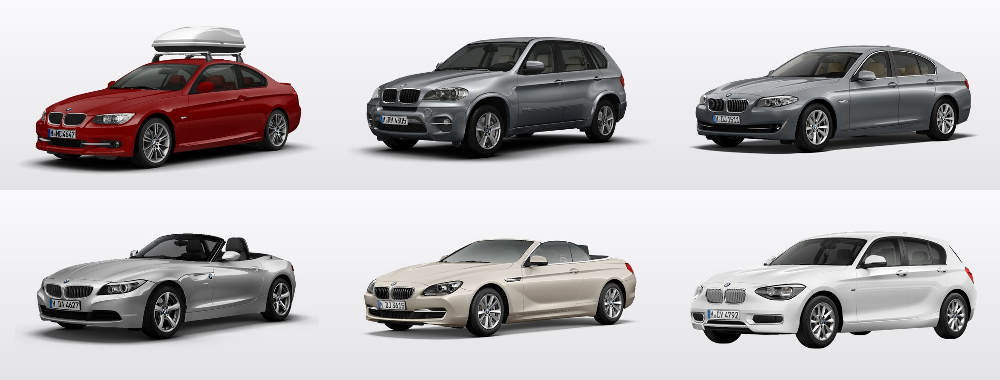
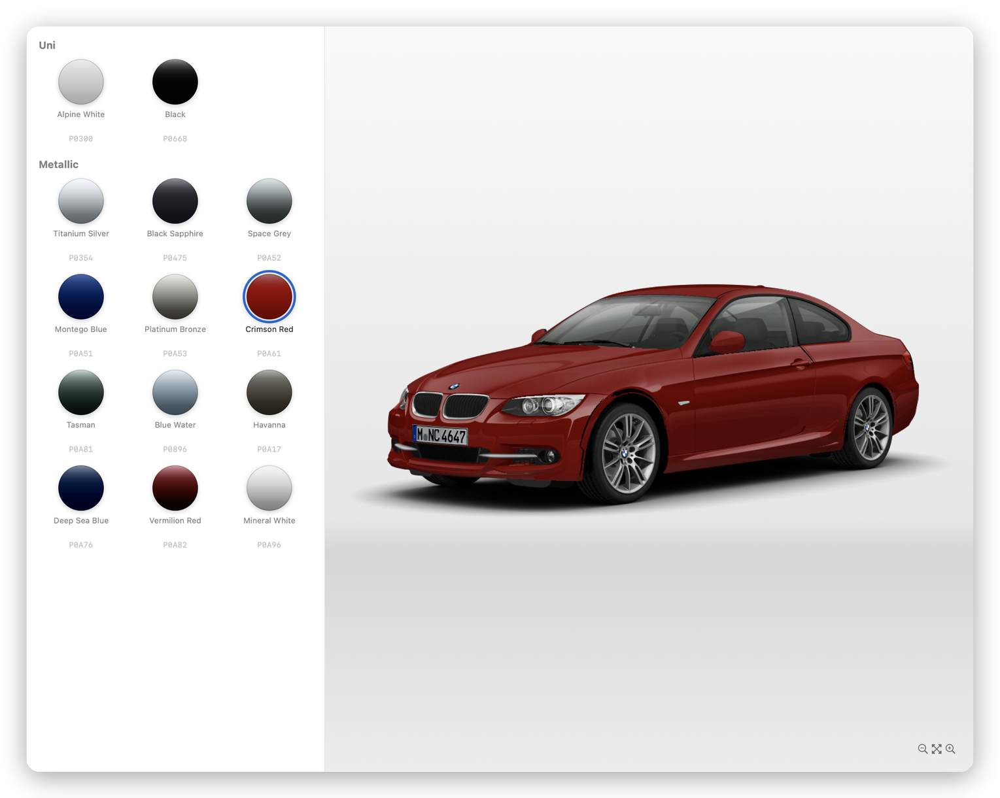
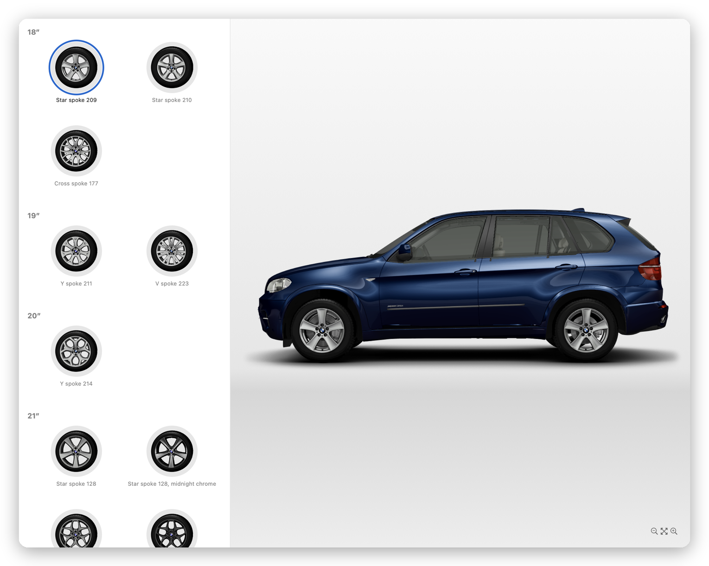
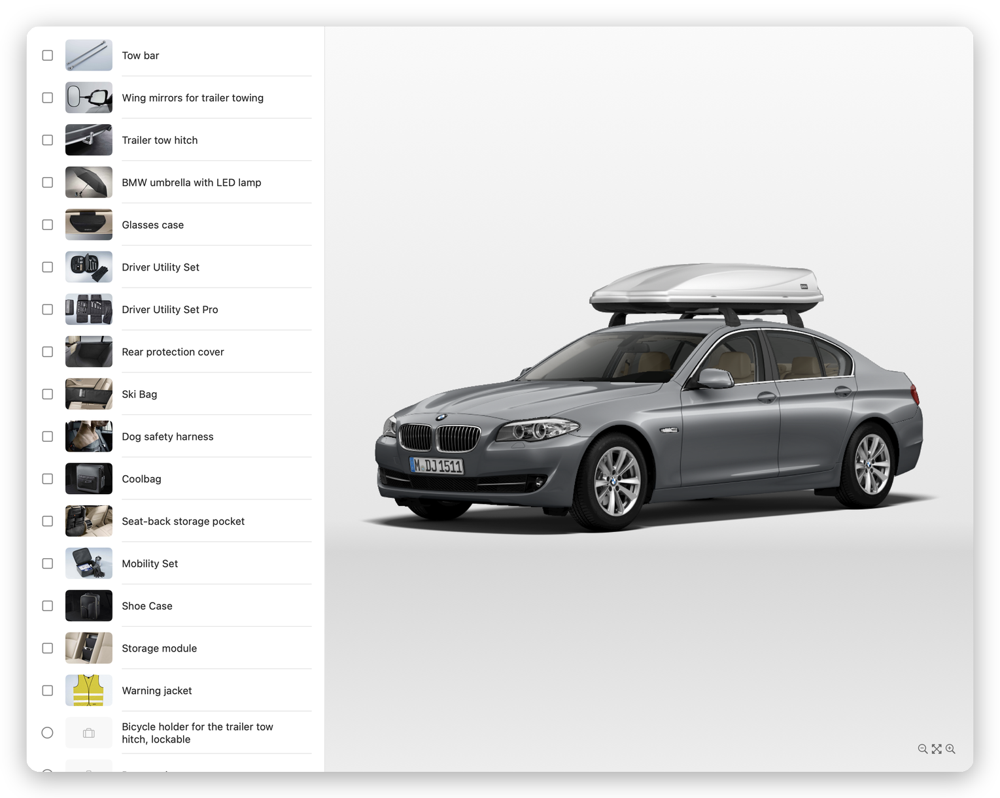
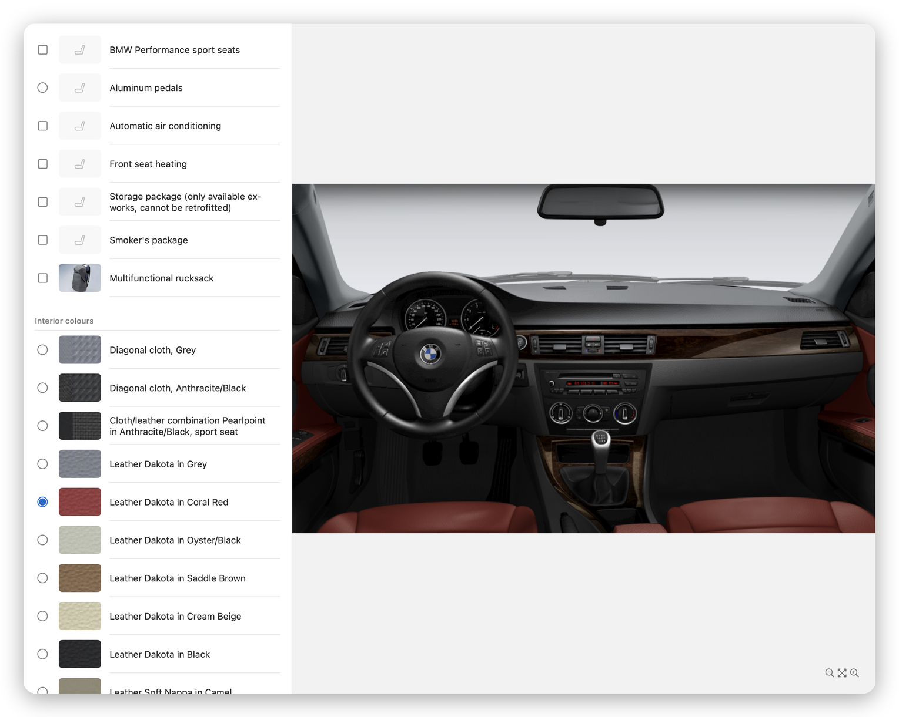
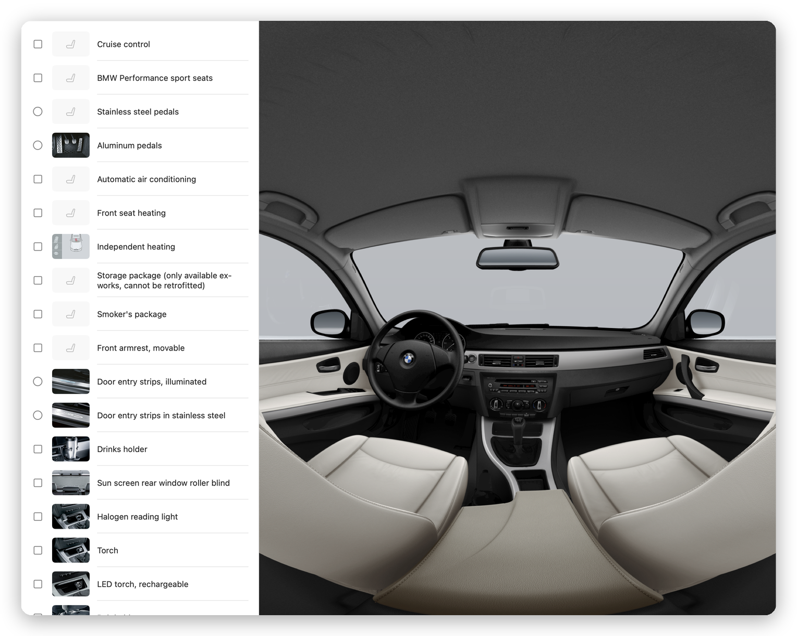
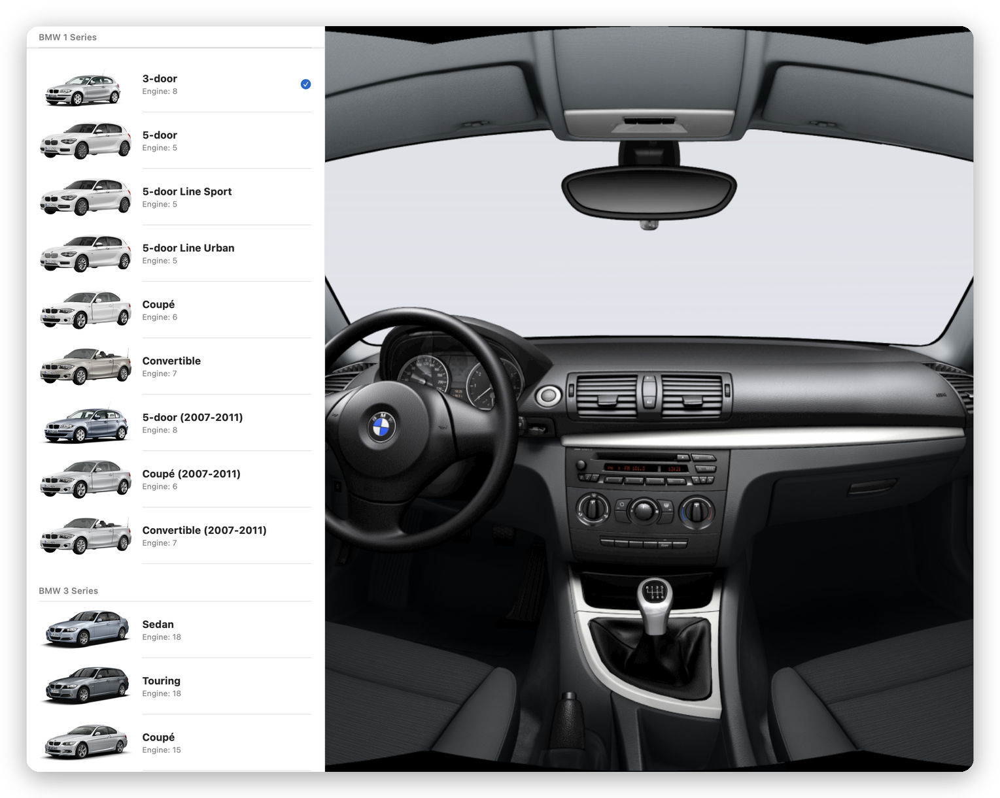
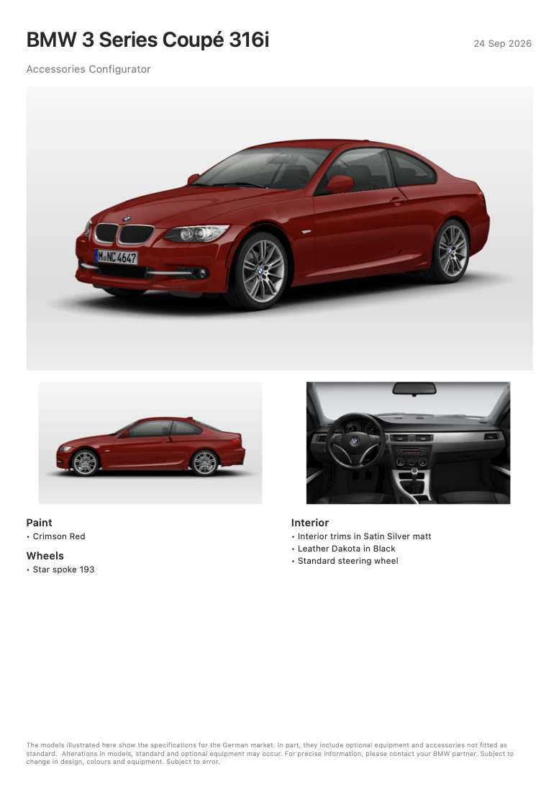
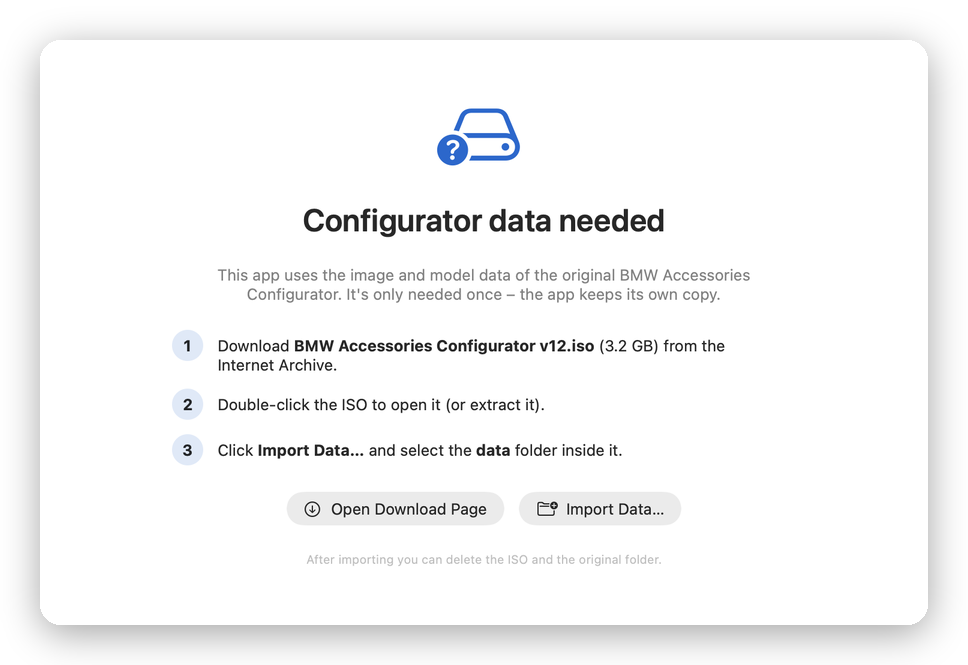

<div align="center">


# BMW Configurator V12 ReMake for macOS

**A native macOS rebuild of the 2011 BMW Accessories Configurator.**<br>
Configure 37 BMW models from the 1 Series to the Z4, then paint, fit wheels and accessories, and look around a 360° interior. Written in Swift and SwiftUI, with no Windows, Wine or emulation.

[](CHANGELOG.md)
[](#requirements)
[](https://swift.org)
[](https://developer.apple.com/xcode/swiftui/)
<br>
[](#requirements)
[](LICENSE)
[](#features)
[](../../issues/new/choose)



</div>

---

## Contents

- [About](#about)
- [Features](#features)
- [Screenshots](#screenshots)
- [Requirements](#requirements)
- [Getting the configurator data](#getting-the-configurator-data)
- [Installation](#installation)
- [Usage](#usage)
- [How it works](#how-it-works)
- [Known limitations](#known-limitations)
- [Reporting bugs & feedback](#reporting-bugs--feedback)
- [Roadmap](#roadmap)
- [License & legal](#license--legal)

## About

The *BMW Accessories Configurator* (the "v12" disc, software version 10.0) was a Windows program BMW dealers used around 2011. You picked a car, then tried paint colours, wheels and accessories on photo-realistic renders. Its rendering engine (IMAGIC's "COSY/iris") and data formats were proprietary and Windows-only.

This project is a **clean-room native reimplementation** for the Mac. The file formats, the layer compositing engine and both scripting languages were reverse-engineered and rewritten in Swift. The app reads the original `data` folder unchanged.

## Features

| | |
|---|---|
| 🚗 **37 body styles, every engine** | All 10 series: 1, 3, 5, 6 and 7 Series, X1, X3, X5, X6 and Z4, including older generations |
| 🎨 **Paint** | Solid and metallic finishes, with metallic flake and reflections rendered per paint |
| 🛞 **Wheels** | Every approved rim, grouped by size, with tyre and rim fitments |
| 🧩 **Accessories** | Exterior, interior, communication and luggage options, with photos, and the original rules ("this needs a roof rack, add it?") |
| 🪑 **Interior** | Upholstery, trims and steering wheels on a live dashboard view |
| 🌐 **360° panorama** | Drag around the full interior |
| 🔍 **Views** | Front, side, rear, interior and panorama, with zoom and pan |
| 🖨️ **Print & export** | A one-page A4 summary sheet (print or PDF), PNG/JPEG export, and save/open configurations (`.bmwconfig`) |
| ↩️ **Undo / redo** | For every change |
| 🌍 **8 languages** | German, English, French, Spanish, Italian, Dutch, Swedish, Portuguese |
| ✨ **Native Mac app** | SwiftUI, Liquid Glass app icon, light and dark mode, keyboard shortcuts |

## Screenshots

<table>
  <tr>
    <td width="50%"><br><sub><b>Paint</b>: 3 Series Coupé in Crimson Red</sub></td>
    <td width="50%"><br><sub><b>Wheels</b>: X5, grouped by rim size</sub></td>
  </tr>
  <tr>
    <td><br><sub><b>Accessories</b>: 5 Series with a roof box</sub></td>
    <td><br><sub><b>Interior</b>: Coral Red leather and walnut trim</sub></td>
  </tr>
  <tr>
    <td><br><sub><b>360° panorama</b>: drag to look around</sub></td>
    <td><br><sub><b>Model browser</b>: every series and body style</sub></td>
  </tr>
</table>

<details>
<summary><b>Printed summary sheet</b></summary>
<br>

</details>

## Requirements

- **macOS 26 (Tahoe) or later**, including macOS 27. A universal build for Apple Silicon and Intel.
- **The original BMW Accessories Configurator data** (about 3.2 GB). It is **not included** in this repository or its releases; see [Getting the configurator data](#getting-the-configurator-data).
- About **3.5 GB of free disk space** for the app's copy of the data, plus room for the download while you import it.

## Getting the configurator data

The app needs the `data` folder from the original configurator's disc. An archived copy is on the Internet Archive:

1. Go to **[archive.org/details/bmw-accessories-configurator-v-12](https://archive.org/details/bmw-accessories-configurator-v-12)**.
2. Download **`BMW Accessories Configurator v12.iso`** (3.2 GB). Under *Download Options*, choose *ISO Image* (or use the torrent).
3. **Double-click the ISO** in Finder to open it as a disk. Alternatively, extract it with an archive tool such as [The Unarchiver](https://theunarchiver.com) or [Keka](https://www.keka.io).
4. Inside you'll find a folder called **`data`** (next to `Configurator.exe`). This is the folder the app needs.

You'll select this folder once, in the app. See step 4 of [Installation](#installation).

> [!NOTE]
> The data is copyrighted material from BMW and its agencies. This project does not host or distribute it. The Internet Archive link is provided for convenience; check that your use complies with the laws where you live.

## Installation

1. Download **`BMW-Configurator-1.0.0.dmg`** from the [**latest release**](../../releases/latest).
2. *(Optional)* [Verify the download](#verifying-the-download).
3. Open the DMG and drag **BMW Configurator** onto the **Applications** folder.
4. Open **BMW Configurator** from Applications. It isn't notarised by Apple, so the first time macOS blocks it:
   - Click **Done** on the warning, then open **System Settings → Privacy & Security**, scroll down and click **Open Anyway** next to *"BMW Configurator" was blocked*. Confirm with **Open Anyway** and your password.
   - *Or*, in Terminal:
     ```bash
     xattr -dr com.apple.quarantine "/Applications/BMW Configurator.app"
     ```
   You only need to do this once.
5. On first launch, click **Import Data…** and select the **`data`** folder, either on the mounted ISO or from wherever you extracted it. Selecting the mounted ISO itself also works.
   - The app **copies** the data into its own storage, with a progress bar. This takes a minute or two.
   - When it finishes, you can **eject and delete the ISO** and delete any extracted folder. The app no longer needs them.
   - The copy lives in `~/Library/Application Support/BMW Configurator/data`. **Settings → Configurator data** shows it in Finder or re-imports it.

<p align="center"></p>

> [!TIP]
> **Updating:** download the new DMG and replace the app in Applications. Your imported data and settings are kept, so there's no need to import again.<br>
> **Uninstalling:** delete the app and the `~/Library/Application Support/BMW Configurator` folder.

### Verifying the download

Each release lists a **SHA-256 checksum**, both in the release notes and as a `.sha256` file. To check that your download is intact and unmodified, open Terminal in the folder containing the DMG (usually Downloads) and run:

```bash
cd ~/Downloads
shasum -a 256 BMW-Configurator-1.0.0.dmg
```

The long code it prints must match the checksum on the release page exactly. If you also downloaded the `.sha256` file, this checks it for you:

```bash
shasum -a 256 -c BMW-Configurator-1.0.0.dmg.sha256
```

It should say `BMW-Configurator-1.0.0.dmg: OK`.

## Usage

1. **Pick a car:** open **Models** in the sidebar, choose a body style, then an engine.
2. **Configure:** use **Paint, Wheels, Exterior, Interior, Communication** and **Luggage** in the sidebar. Click an option to add or remove it; the car updates immediately.
3. **Change the view** with the toolbar (**Front / Side / Rear / Interior / Panorama**) or `⌘1` to `⌘5`. Pinch or double-click to zoom; drag the panorama to look around.
4. **Details:** the inspector on the right shows photos, notes and tyre sizes for the last option you touched.
5. **Keep it:** `⌘S` saves the configuration, `⌘E` exports the picture and `⌘P` prints a summary sheet.

| Shortcut | Action |
|---|---|
| `⌘N` | Choose model |
| `⌘O` / `⌘S` | Open / save configuration |
| `⌘E` | Export image |
| `⌘P` | Print summary |
| `⌘Z` / `⇧⌘Z` | Undo / redo |
| `⌘1` … `⌘5` | Front, side, rear, interior, panorama |

## How it works

<details>
<summary>A short tour of the reverse engineering</summary>

- **Image containers (`.map`, `.z`):** a fixed 4 KB preamble, then a header with bit depth, size and position. The payload is JPEG, PNG, raw pixels, or a zlib stream of bottom-up tiles. `.z` files are 16-bit depth maps. A few 2008 files use an older wrapper around a plain JPEG.
- **Colours (`.col`):** three 256-entry ramps that turn a grey paint mask into a real paint colour.
- **Vehicle scripts (`def/vehicles/*.inf`):** a small language (`$S`, `$L`, `$C`, `$Z`, `$V`, `$I`, `$D`, `$G`, `$O`, `$W`, …) that switches options on, loads layers, colours masks, jumps between rules and mounts wheels. The engine layers dozens to hundreds of images per view and depth-sorts them with the `.z` maps, using blend modes such as screen, multiply and overlay.
- **Configurator definitions (`def/*.inf`):** an XML-like format with macros, includes and conditionals describing series, bodies, engines, options and rules.
- A few details, such as how wheels are sized and placed, were confirmed by disassembling the original `iris.dll`.
</details>

## Known limitations

- The data set is from **2011**, so models and accessories stop there.
- The optional **Performance** menu is hidden, as it was in the original data.
- Close-up wheel animations and the "night vision" view from the original are not implemented.
- The older **X3 (2006–2010)** has no panorama in the original data.
- A handful of accessory photos are missing from the original data and show a generic icon.

Found something else? Please [report it](#reporting-bugs--feedback).

## Reporting bugs & feedback

Feedback is very welcome, and updates are planned.

- 🐞 **Bug:** [open a bug report](../../issues/new?template=bug_report.yml). The quickest way is **Help → Report a Bug…** in the app, which opens a pre-filled report with your app version, macOS version and the car you were configuring.
- 💡 **Idea or feature request:** [suggest a feature](../../issues/new?template=feature_request.yml).
- 📋 **Diagnostics:** **Help → Copy Diagnostic Info** copies the same details to paste anywhere.

A screenshot makes most visual bugs much easier to fix: include the car, engine, view and options you had selected.

## Roadmap

- [ ] Notarised, signed releases
- [ ] Optional Performance menu
- [ ] Wheel close-up view
- [ ] Side-by-side comparison of two configurations
- [ ] Shareable configuration links

See the [changelog](CHANGELOG.md) for what's new in each version.

## License & legal

The **BMW Configurator app** and this documentation are released under the [MIT License](LICENSE).

> [!IMPORTANT]
> This is an independent, unofficial project. It is **not affiliated with, endorsed by or sponsored by BMW AG** or IMAGIC Grafik GmbH.
> **BMW**, the **BMW logo** and all model names are trademarks of BMW AG and are used here only to identify the software this project is compatible with.
> The original configurator software and its **data** (images, renders, texts and definitions) are copyrighted by their owners. They are **not part of this repository or its releases**, are **not covered by the MIT license**, and must not be redistributed. Use your own lawfully obtained copy.

<div align="center"><sub>Made by <a href="https://github.com/CaptainBurton">CaptainBurton</a> with Swift and SwiftUI.</sub></div>
